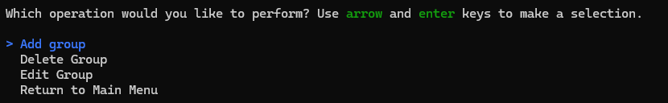

# Console-Phonebook
Simple contact-management app using MSSQL and EF core. Add contacts, add them to optional groups, edit or delete contacts and groups. Makes use of Spectre.Console to beautify the console a little bit.

## Features
- Track your contacts! Add their phone numbers and emails!

## Getting started
- After cloning repo, make sure you have MSSQL server set up.
- IMPORTANT: replace your own MSSQL server information in the OnConfiguring method of PhoneBookContext.cs.

## Comments
- This project was another chance to practice working with databases. I also used regex to validate emails and phone numbers, which was a personal first.

## Credit
This project was originally forked from the [C# Academy repo](https://github.com/TheCSharpAcademy/CodeReviews.Console.Phonebook). It has been reuploaded to its own independent repo because the fork contained other students' versions of the project. Shout out to Pablo for making such a great resource!
